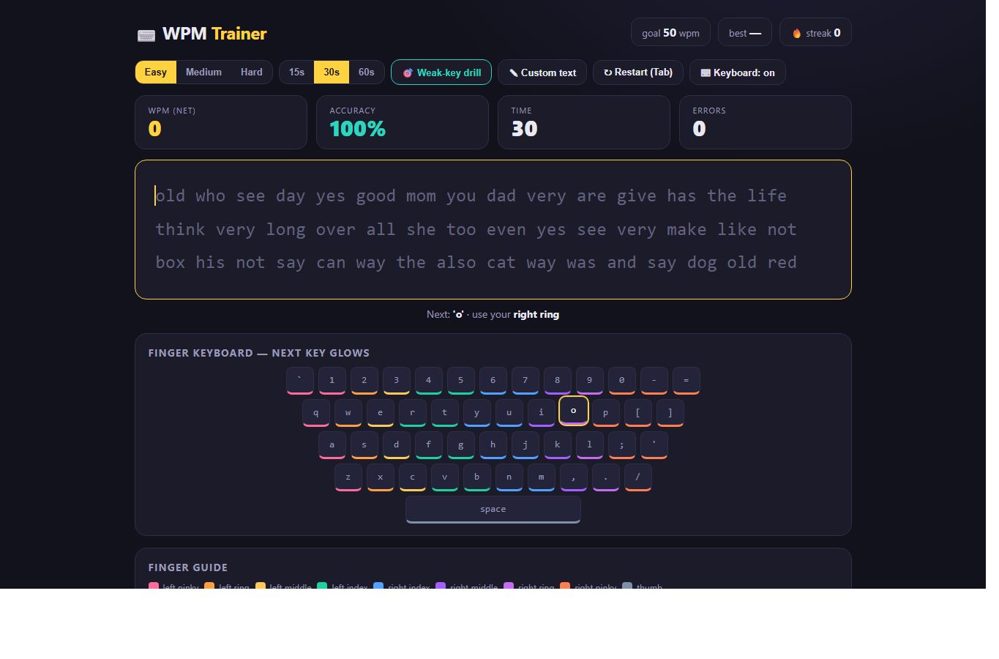

# WPM Trainer

A clean, **zero-dependency** typing-speed trainer that runs entirely in the browser — built to
measurably improve real words-per-minute, not just test it.

🔗 **Live demo:** https://ghravenlabs.github.io/WPM-Trainer/

## Portfolio proof
- [Case study](PORTFOLIO-CASE-STUDY.md) — how the app turns a simple typing test into a training loop.
- GitHub Actions runs regression tests for saved progress and session controls, plus static app checks, on every push.

## Features
- **Live test** — Easy/Medium/Hard text, 15/30/60s, with **net WPM, accuracy, errors** updating as you type
- **Per-character error highlighting** + blinking caret
- **Finger keyboard** — color-coded by finger; the **next key glows** and tells you which finger to use (trains touch typing)
- **Weak-key drills** — records every key you mistype and generates a drill targeting *your* worst keys
- **Progress tracking** — best, average, streak, and a sparkline with your goal line (all saved locally)
- **Custom text** + a celebratory confetti when you beat your goal

## Tech
- **Vanilla HTML/CSS/JavaScript** — no frameworks, no build step, no dependencies
- `localStorage` for progress + weak-key history · `IntersectionObserver`-free, pure DOM
- Single self-contained file → works offline, deploys anywhere static

## Run it
- **Locally:** open `index.html` in any browser.
- **Deploy:** push to GitHub and enable **Pages** — it's static, so it just works.

## Privacy
Everything runs client-side; your stats live only in your browser's `localStorage`.
If browser storage is blocked or full, practice continues with session-only progress and a
visible notice. That temporary progress disappears when the page closes. Invalid saved entries
are ignored so they cannot prevent the trainer from starting.

## Development checks

Run `node --test tests/trainer.test.cjs` with Node.js 24. No package install is needed.
Ctrl/Cmd shortcuts and in-progress IME composition are ignored by scoring; ordinary
characters and AltGraph input still reach the trainer. Full IME text-entry support is not implemented.

## License
MIT © Rolly Calma ([Ghraven](https://github.com/Ghraven))
